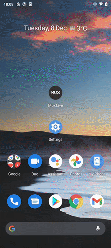

# Mux Android Broadcast Demo

This application is an example of using the free and open source [rtmp-rtsp-stream-client-java RTMP library](https://github.com/pedroSG94/rtmp-rtsp-stream-client-java) to create an Android app which can broadcast reliably to [Mux](https://mux.com/).

This app replaced the previous Android example which used JavaCV, and lived in the `/android-live-javacv` directory.

## Functionality

* RTMP broadcasting
* Mid-stream camera switching
* Reconnects on network dropout or network change (EG: Wifi => 4G)
* RTMP Adaptive Bitrate (untested)
* FPS and Bitrate monitoring
* 4 basic profiles broadcasting profiles from 360p @ 1mbps to 1080p @ 5mbps
* Rotation prior to broadcast start

## Demo



## TODO 

* ABR is untested (Android makes this frustratingly hard)

## Limitations

* I've seen the stream start without audio, I'm not sure if this was a one-off or something else.
* App rotation locks when streaming. This isn't ideal, but is [unavoidable right now, as changing the preview orientation isn't possible once the preview is started.](https://github.com/pedroSG94/rtmp-rtsp-stream-client-java/issues/730#issuecomment-731025429)
* [Tap to focus isn't supported by rtmp-rtsp-stream-client-java](https://github.com/pedroSG94/rtmp-rtsp-stream-client-java/issues/679)
* Frame rate is unstable on the 1080p encoding profile
* [Some devices produce upside down video](https://github.com/pedroSG94/rtmp-rtsp-stream-client-java/issues/266).

# Quick Start

Just clone this repo, and open the directory in Android Studio > 4, select the "app" project, connect a device, and just click the play button.

## Prerequisites

To use this application, you'll need a [Mux account](https://dashboard.mux.com/signup?type=video) and an [RTMP stream key](https://docs.mux.com/guides/video/start-live-streaming#2-create-a-unique-live-stream).

If you're new to Mux or live streaming in general, you can follow our [Start Live Streaming guide](https://docs.mux.com/guides/video/start-live-streaming) for a tutorial on getting your first live stream created, and obtaining an RTMP stream key.

## Dependencies

* Min SDK version 21
* Built in Android Studio 4.1
* Dependencies are managed using Gradle

# Support

Mux will provides basic support for the features shown in this example. Please raise a GitHub issue if you run into problems, but remember that we are limited to functionality that rtmp-rtsp-stream-client-java provides.

# Documentation

This project uses [rtmp-rtsp-stream-client-java RTMP library](https://github.com/pedroSG94/rtmp-rtsp-stream-client-java) to reliably broadcast a live stream from an Android device to an RTMP endpoint, in this case, [Mux](https://mux.com/).

## Code Overview

This project is relatively simple, due to the fairly comprehensive feature set in rtmp-rtsp-stream-client-java. It consists of two main java classes, `ConfigureActivity.java`, and `BroadcastActivity.java`.

Below is an overview of the codebase, but it's often best to just get stuck in and read the code - it's short, and liberally documented.

### ConfigureActivity.java

This Activity acts as the entrypoint of the application, and allows the user to enter a Stream Key.

### BroadcastActivity.java

Most of the application is implemented in BroadcastActivity.swift, it's fairly short, around 250 lines right now, and is deliberately not broken into multiple files or classes. Here's an overview of how it works. 

#### onCreate()

When the application is started, the main entrypoint, `onCreate()` is called. First, this performs basic boilerplate to setup the UI elements, including the `surfaceView`, which is used as the preview for the camera. 

```java
    // Init the Surface View for the camera preview
    surfaceView = findViewById(R.id.surfaceView);
    surfaceView.getHolder().addCallback(this);
```

Next it instantiates the `RTMPCamera1`, passing in a reference to the preview, and setting up a callback for the FPS change events. 

```java
    // Setup the camera
    rtmpCamera = new RtmpCamera1(surfaceView, this);
    rtmpCamera.setReTries(1000); // Effectively retry forever

    // Listen for FPS change events to update the FPS indicator
    FpsListener.Callback callback = new FpsListener.Callback() {
        @Override
        public void onFps(int fps) {
            Log.i(TAG, "FPS: " + fps);
            BroadcastActivity.this.runOnUiThread(new Runnable() {
                public void run() {
                    fpsLabel.setText(fps + " fps");
                }
            });
        }
    };
    rtmpCamera.setFpsListener(callback);
```

Finally, it pulls the RTMP stream key, and the encoding preset from the intent that launched the action.

#### surfaceChanged()

Much of the camera preview manipulation logic happens in `surfaceChanged()`. This is called when the surface is initially rendered (when the activity is launched), but also when the device is rotated. 

This function serves two important purposes:

1) Stopping and starting the preview each time the surface changes, in order to correct for rotation.
2) Updating the layout slightly based on the rotation, in order to keep the aspect ratio of the preview correct.

#### goLiveClicked()

When the go live button is tapped, we first lock the app's orientation, then configure the camera for streaming, and finally, start the stream.

```java
    // Configure the stream using the configured preset
    rtmpCamera.prepareVideo(
            preset.width,
            preset.height,
            preset.frameRate,
            preset.bitrate,
            2, // Fixed 2s keyframe interval
            CameraHelper.getCameraOrientation(this)
    );
    rtmpCamera.prepareAudio(
            128 * 1024, // 128kbps
            48000, // 48k
            true // Stereo
    );

    // Start the stream!
    rtmpCamera.startStream(rtmpEndpoint + streamKey);
```
